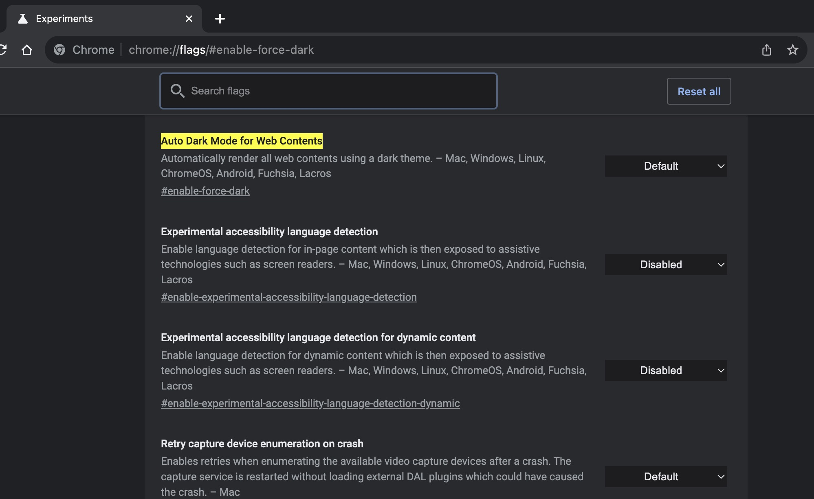

# Force web content into dark mode
Enter `chrome://flags/#enable-force-dark` in Chrome's address bar.

Then enable the `Force Dark Mode for Web Contents` feature.

Finally click on the `Relaunch` button in the prompt message below.
